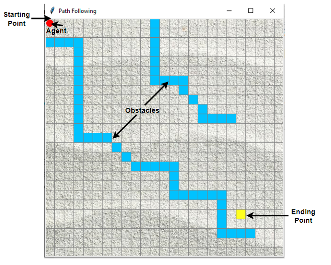

# qlearn-agent-path
The following is an example of model-free reinforcement learning.
It simulates a robot that we want to move from some starting location to some ending goal location while avoiding obstacles.

# Reinforcement learning
Reinforcement learning is the science of making optimal decisions using experiences. 
The process of reinforcement rearning involves these simple steps:
1. Observation of the environment
1. Deciding how to act using some strategy
1. Acting accordingly
1. Receiving a reward or penalty
1. Learning from the experiences and refining our strategy
1. Iterate until an optimal strategy is found

# Q-learning
Q-learning is a model-free reinforcement learning algorithm.

Q-learning is a values-based learning algorithm. Value based algorithms updates the value function based on an equation (particularly Bellman equation).
Policy-based estimates the value function with a greedy policy obtained from the last policy improvement.

Q-learning is an 'off-policy learner'. This means it learns the value of the optimal policy independently of the agent’s actions.
Conversely, an 'on-policy learner' learns the value of the policy being carried out by the agent, including the exploration steps and it will find a policy that is optimal, taking into account the exploration inherent in the policy.

## What’s this ‘Q’?
The ‘Q’ in Q-learning stands for quality. Quality here represents how useful a given action is in gaining some future reward.

### Q-learning Definition
Q*(s,a) is the expected value (cumulative discounted reward) of doing a in state s and then following the optimal policy.
Q-learning uses Temporal Differences(TD) to estimate the value of Q*(s,a). Temporal difference is an agent learning from an environment through episodes with no prior knowledge of the environment.
The agent maintains a table of Q[S, A], where S is the set of states and A is the set of actions.
Q[s, a] represents its current estimate of Q*(s,a).

# Demo
Let’s say an agent has to move from a starting point to an ending point along a path that has obstacles. 
The agent needs to reach the target in the shortest path possible without hitting in the obstacles and he needs to follow the boundary covered by the obstacles. 
The demo starts with a customized grid environment as follows.

## Files
There are three python files in this repo.
1. path.py - defines an environment which has obstacles, final point to reach, and a robot to move
1. agent.py - defines an agent that will be used to apply reinforcement learning. 
1. run.py - runs the q-learning algorithm to learn a path
